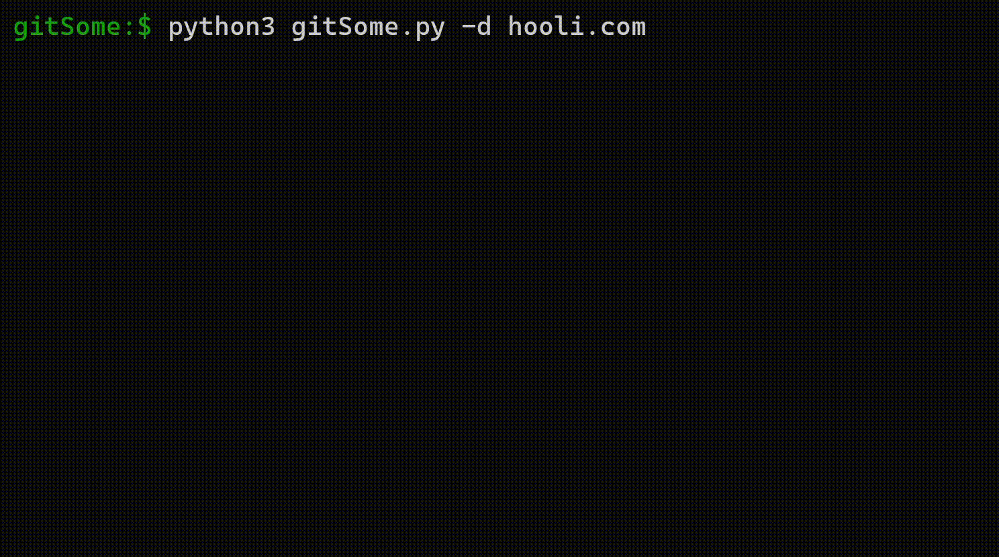
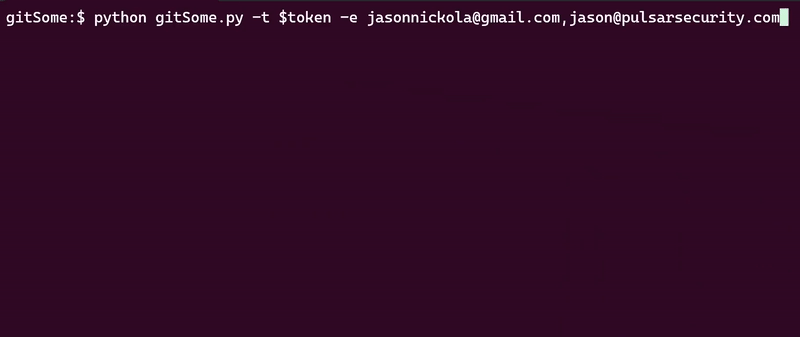

# gitSome

## Overview

OSINT tool to extract email addresses and other useful info from various GitHub sources.

 * NEW! Provide one or more email addresses to identify the asociated GitHub account
    * Requires a [GitHub personal access token](https://docs.github.com/en/enterprise-server@3.13/authentication/keeping-your-account-and-data-secure/managing-your-personal-access-tokens#creating-a-personal-access-token-classic), SSH access to GitHub, and git deployed locally
 * Provide a user account to:
    * Extract emails from associated repos
    * Return orgs the user is a member of
 * Provide an org account to:
    * Extract emails from associated repos
    * Return users that are members of the org
 * Provide a domain to extract related email addresses from public commits, issues, and other sources
 * Built-in FireProx to automatically create endpoints, rotate source IP, and cleanup at the end
    * Forked and modified ([chm0dx/fireprox](https://github.com/chm0dx/fireprox)) from the awesome [ustayready/fireprox](https://github.com/ustayready/fireprox)

## Install

    git clone https://github.com/chm0dx/gitSome.git
    cd gitSome
    pip install -r requirements.txt

## Use

    usage: gitSome.py [-h] (-d DOMAIN | -u USER | -r REPO | -e EMAILS) [-t TOKEN] [-f] [-p PROXY] [-j] [-i IGNORE] [-fp] [--secret_access_key SECRET_ACCESS_KEY]
                  [--access_key ACCESS_KEY] [--region REGION] [--max_commits MAX_COMMITS]

    Extract email addresses and other info from various GitHub sources

    optional arguments:
      -h, --help            show this help message and exit
      -d DOMAIN, --domain DOMAIN
                            Search public commits, issues, and users for emails belonging to the provied domain.
      -u USER, --user USER  Search repos of the provided GitHub user (or org) account.
      -r REPO, --repo REPO  Search the provided GitHub repo.
      -e EMAILS, --emails EMAILS
                            File or comma-separated list of emails to convert into GitHub accounts. Requires an API token, SSH access to GitHub, and git deployed locally.
      -t TOKEN, --token TOKEN
                            Authenticate searches using the given GitHub personal access token to increase rate limit, search private resources, and allow for email-to-account conversion.
      -f, --forks           Include commits from forked repos.
      -p PROXY, --proxy PROXY
                            Send requests through a web or SOCKS proxy.
      -j, --json            Return full json results.
      -i IGNORE, --ignore IGNORE
                            The name of a repo or account to ignore.
      -fp, --fireprox       Auto configure and use a FireProx endpoint. Pass in credentials or use the ~/.aws/credentials file.
      --secret_access_key SECRET_ACCESS_KEY
                            The secret access key used to create FireProx resources in AWS.
      --access_key ACCESS_KEY
                            The access key used to create FireProx resources in AWS.
      --region REGION       The AWS region to create FireProx resources in.
      --max_commits MAX_COMMITS
                            Max number of commits to analyze per repo. Defaults to 1000.

    Examples:
      python3 gitSome.py -d hooli.com
      python3 gitSome.py -u orgName
      python3 gitSome.py -u userName
      python3 gitSome.py -e gavbel@hooli.io,baghead@hooli.io -t token
      python3 gitSome.py -r userName/repoName -p http://0.0.0.0:8080
      python3 gitSome.py -u orgName -t github_pat_xxx -r ignored/repo -r ignored_account
      python3 gitSome.py -u user --fireprox
      python3 gitSome.py -d hooli.com --fireprox --access_key xxxx --secret_access_key xxxx --region us-west-2

## The Email Option

Pass in a list of email addresses and return the associated GitHub accounts!

When pushing commits from a git instance, GitHub will analyze the commit's author field and enrich the commit with the GitHub login (user) associated with the email, if it exists. gitSome's -e option automates the process of creating a repo, generating a commit, pushing to GitHub, and analyzing the commit to associate email addresses with corresponding GitHub accounts.

This option requires:
   * A [GitHub personal access token](https://docs.github.com/en/enterprise-server@3.13/authentication/keeping-your-account-and-data-secure/managing-your-personal-access-tokens#creating-a-personal-access-token-classic)
      * Ensure that the token has the ability to delete repositories if you want gitSome to clean up after itself
   * SSH access to GitHub
   * git deployed locally

## Disclaimer

The power is yours and so is the responsibility to understand GitHub API policies :)

